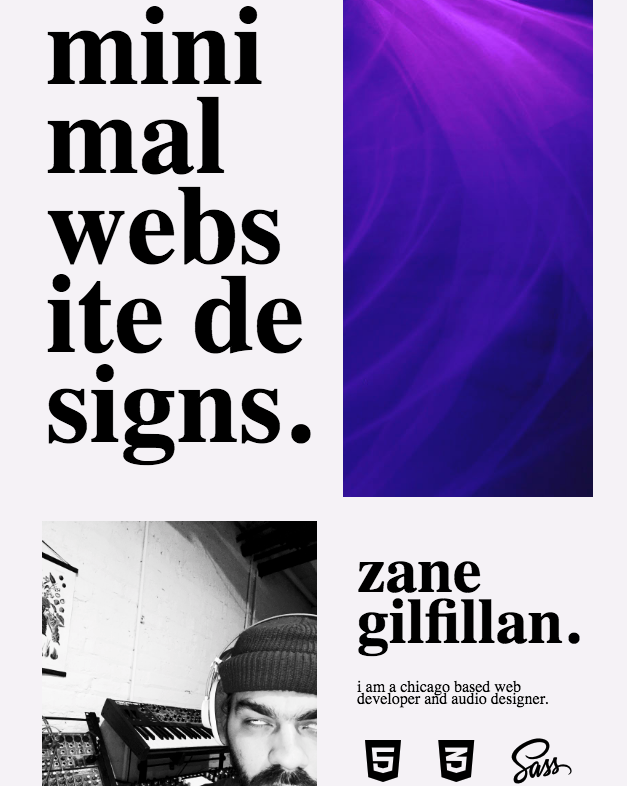
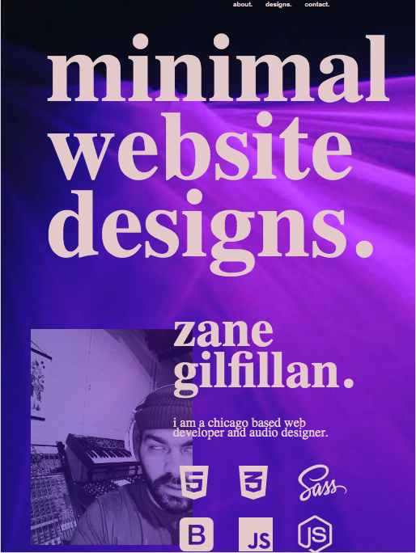
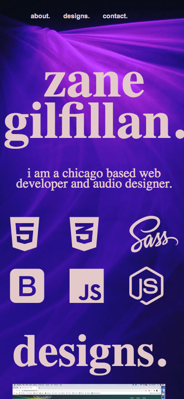

# Personal Portfolio

The current build of this site is mainly utilizing SASS for all of it's styling and responsiveness.

I currently have two designs of the site; one for when it is viewed on a desktop and then a stark contrast for then when page is minimized in width, or when viewed on mobile devices. a portion of the site can be seen below:

i still need to find a smoother/more creative way to implement the links in the 'design' section. that currently is my biggest focus.

# Current Ideas

I'm still working on implementing a "dark mode" option for the site. the more I altered the design for the mobile devices the more i prefered that version. While still like the stark contrast between the two iterations I may end up just making that the overall design.

I also may have the mobile designs BECOME the dark mode option once i get to that point in the code. I'll most likely have to reorganize my style sheets moving forward with this plan.

# tablet design
i'm still working on changing the 'design' images to be links when screen is at this view. otherwise, i am incredibly happy with this design.

# mobile design
this has proven the most difficult for me due to the lack of space. so i'm struggling with the spacing ideas of adding a profile image/picture.

